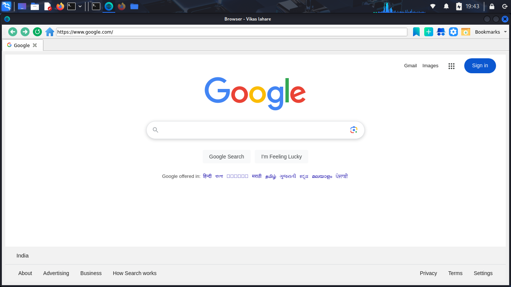
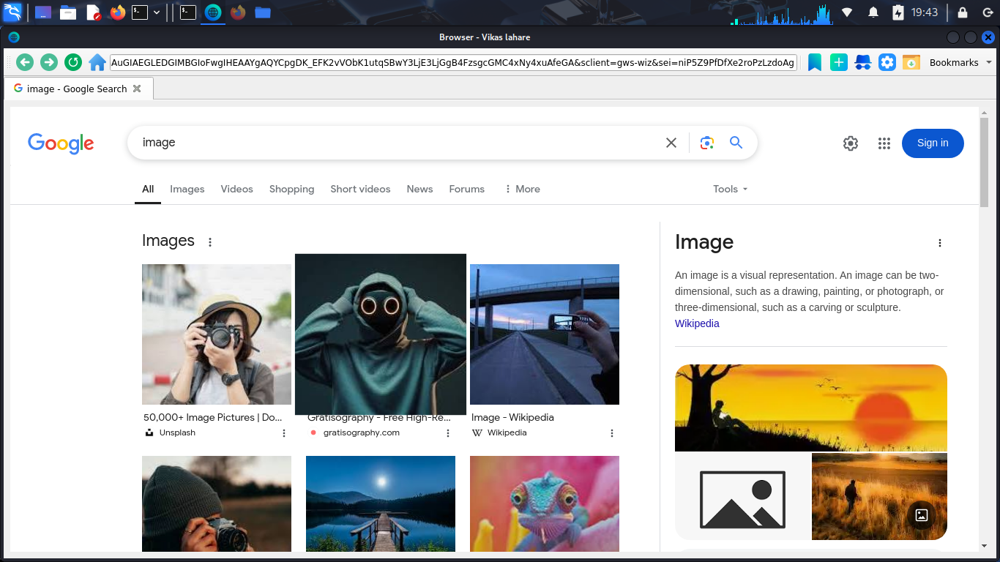
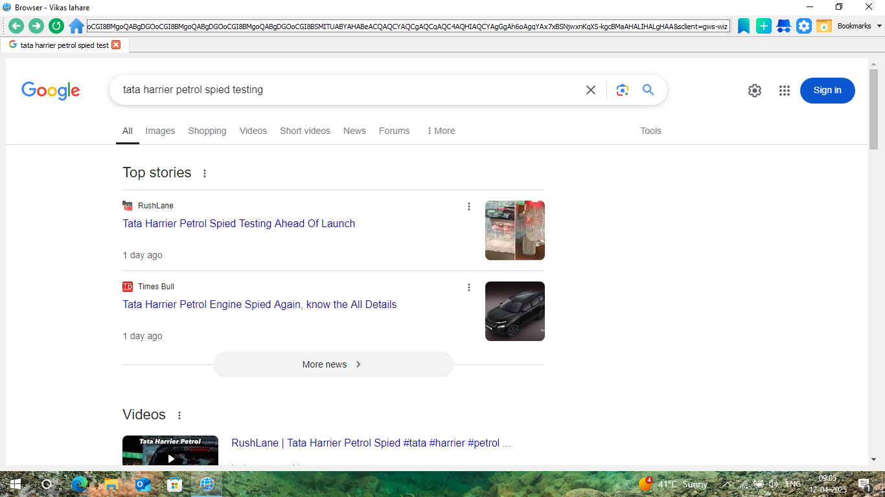
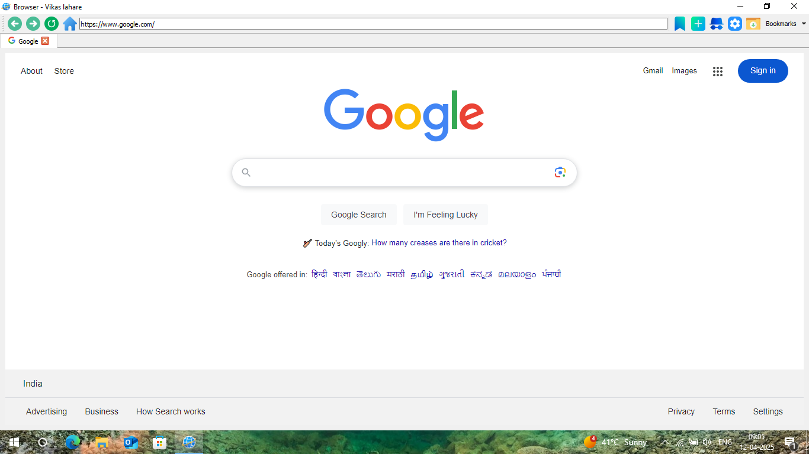

# WebBrowser

# Requirements
```
apt-get install python3
apt-get install python3-pip

pip install PyQt5 PyQtWebEngine
```

# Linux

> Download : https://www.mediafire.com/file/tzelcg3dp6ki82d/WebBrowser.deb




# Windows

> Download : https://www.mediafire.com/file/2mzwqygiz2hfz2c/setup.exe



